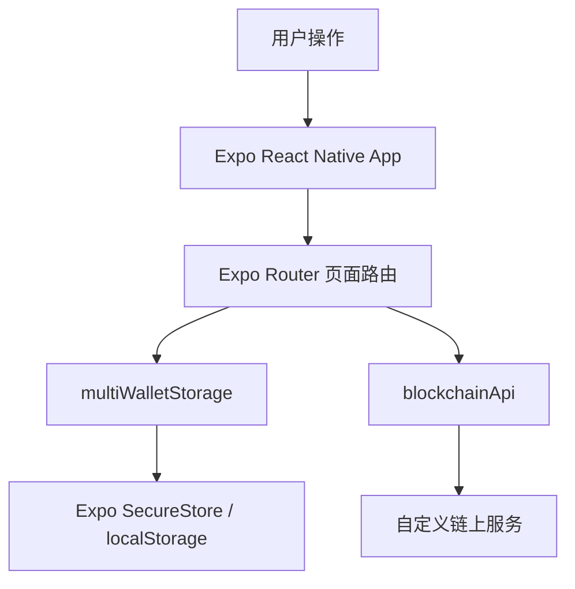
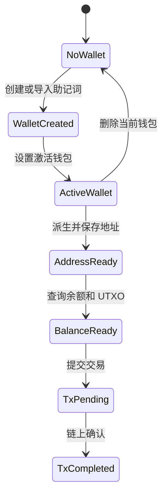

# Bitcoin Wallet

面向移动端的比特币钱包工程，基于 Expo Router、React Native、TypeScript 构建。项目覆盖钱包创建、助记词导入、HD 地址派生、地址二维码、余额/UTXO 查询、交易记录、交易详情和基础发送流程，适合作为链上钱包 App 的前端工程底座。

> 重要说明：当前项目依赖自定义链上服务接口，并且地址生成逻辑以现有后端协议为准。请先在测试网络或私有网络完成安全审计、签名验证、接口验收和资金闭环测试，不要直接承载主网真实资产。

## 核心能力

| 能力 | 当前状态 | 说明 |
| --- | --- | --- |
| 多钱包管理 | 已实现 | 支持创建、切换、删除钱包，维护当前激活钱包 |
| 助记词生成/导入 | 已实现 | 支持 12/18/24 词，支持多语言词表验证 |
| 种子安全存储 | 已实现 | Native 使用 Expo SecureStore，Web 降级 localStorage |
| HD 地址派生 | 已实现 | 使用 `m/44'/0'/account'/0/address` 路径生成地址 |
| 地址管理 | 已实现 | 支持地址列表、二维码、复制、公钥/私钥查看与删除 |
| 余额查询 | 已实现 | 通过链上接口查询总余额、可用余额、成熟中余额和 UTXO |
| 交易记录 | 已实现 | 聚合交易池与历史交易，支持分页、去重和交易 ID 搜索 |
| 交易详情 | 已实现 | 展示交易 ID、时间、类型、状态和金额 |
| 发送交易 | 基础可用 | 选择 UTXO、构建输出、提交到后端 `/transfer` 接口 |
| Android APK 打包 | 已配置 | 支持 EAS preview/production APK 构建 |

## 架构视图



## 状态边界



| 状态 | 可执行动作 | 禁止动作 |
| --- | --- | --- |
| 无钱包 | 创建钱包、导入助记词 | 查询余额、发送交易 |
| 有钱包无地址 | 添加地址、切换钱包、删除钱包 | 接收、发送、查询交易 |
| 有地址无余额 | 接收、刷新余额、查看地址 | 超额发送 |
| 有可用 UTXO | 发送、查询交易池、查看历史 | 使用未成熟 UTXO 直接支付 |

## 技术栈

- Runtime：Expo `~54.0.10`、React Native `0.81.4`、React `19.1.0`
- Router：`expo-router` 文件路由
- Language：TypeScript
- Crypto：`bip39`、`@scure/bip32`、`tweetnacl`、`bs58`、`crypto-js`
- Storage：`expo-secure-store`，Web 端降级为 `localStorage`
- Network：`axios`
- UI：React Native StyleSheet、`@expo/vector-icons`、二维码组件
- Build：EAS Android APK

## 目录结构

```text
bitcoin-wallet
├── app                 # 页面与路由入口
│   ├── (tabs)          # 首页、我的
│   ├── create-wallet   # 创建或导入钱包
│   ├── create-address  # HD 地址派生
│   ├── address-list    # 地址与二维码管理
│   ├── transactions    # 交易历史
│   └── tx-detail       # 交易详情
├── components          # 通用 UI 组件
├── constants           # 主题与常量
├── hooks               # 主题相关 hooks
├── utils
│   ├── blockchainApi.ts # 链上接口、余额、UTXO、交易格式化
│   ├── secureStorage.ts # 多钱包本地存储与加解密
│   └── bitcoinWallet.ts # 钱包工具预留入口
├── assets              # 图标与静态资源
├── eas.json            # EAS 构建配置
└── package.json        # 脚本与依赖
```

## 快速启动

运行环境建议：

- Node.js 20 LTS 或更新版本
- npm 10 或更新版本
- Android Studio 与可用模拟器，或 Android 真机
- Windows PowerShell

```powershell
npm install
npm run start
```

常用启动方式：

```powershell
npm run android
npm run ios
npm run web
```

> Android 真机调试时，当前链上服务使用公网 IP。不要改成 `localhost`，真机无法直接访问开发机 localhost。

## 链上服务配置

当前链上接口集中在 `utils/blockchainApi.ts`：

```text
http://101.35.87.31:18333/bitcoin/chain
```

已使用的接口能力：

- `getAddressAllUTXO`
- `getUTXOsByAddressAndCountAndUTXO`
- `getUTXOsByAddressAndCount`
- `getTxListByAddresInTxPool`
- `getTxListByAddres`
- `transfer`

上线前建议将接口地址改为环境变量或配置中心，不要把生产节点地址硬编码在客户端包内。

## 安全边界

本项目遵循非托管钱包的基础边界：助记词、种子、私钥优先保存在本地，交易构建前从本地钱包状态派生必要密钥。

生产环境必须重点审查：

- 私钥和助记词的展示、复制、日志输出路径
- Web 端 `localStorage` 降级带来的安全风险
- 钱包密码为空时的存储与解密行为
- 地址格式与真实 Bitcoin 主网地址规范的一致性
- 交易签名算法、scriptPubKey 计算和后端验签规则
- HTTP 明文链上服务带来的中间人攻击风险
- Android `usesCleartextTraffic` 当前为 `true`，生产包应关闭或限制域名

## 打包 APK

已配置 `eas.json`，预览包和生产包均输出 APK：

```powershell
npx eas build -p android --profile preview
npx eas build -p android --profile production
```

本地 Android 构建：

```powershell
npm run android
```

更多打包细节可参考仓库内：

- `APK打包指南.md`
- `本地打包指南.md`
- `真机网络调试指南.md`

## 质量门禁

当前项目内置 lint 脚本：

```powershell
npm run lint
```

建议补齐以下工程门禁后再进入生产灰度：

- 钱包存储与密码校验单元测试
- 助记词生成、导入、种子派生边界测试
- 地址派生路径重复检测测试
- UTXO 选择、找零、手续费计算测试
- 交易格式化和交易池去重测试
- 链上接口异常、超时、空数据和脏数据测试

## 关键流程

### 创建钱包

1. 选择助记词语言和词数。
2. 生成或导入助记词。
3. 保存钱包，生成 seed 并写入本地安全存储。
4. 在钱包管理页设置激活钱包。

### 添加地址

1. 输入钱包密码解密 seed。
2. 根据账户索引和地址索引生成派生路径。
3. 派生公钥、私钥和地址。
4. 校验地址和路径不重复后保存到钱包。

### 查询资产

1. 获取当前激活钱包地址列表。
2. 并发查询每个地址的余额和 UTXO。
3. 汇总总余额、可用余额、成熟中余额。
4. 回写钱包余额字段并刷新页面。

### 发送交易

1. 选择发送地址或默认使用首个地址。
2. 查询可花费 UTXO。
3. 校验金额、手续费和余额。
4. 构建输入、目标输出与找零输出。
5. 提交交易到链上服务。

## 开发规范

- 业务逻辑保持直白，避免隐式回退和不可观测补偿。
- 通用能力集中在 `utils`，页面只承载交互编排。
- 关键链路必须保留清晰错误信息，便于真机排查。
- 所有用户输入都要做类型、空值、范围和格式校验。
- 交易和密钥相关代码变更必须优先补测试，再做联调。

## 生产化路线

- 抽离链上服务地址和网络配置。
- 替换明文 HTTP 为 HTTPS。
- 完成标准 Bitcoin 地址、签名、脚本和广播链路校验。
- 增加生物识别或系统级密钥保护。
- 移除敏感日志，限制私钥复制能力。
- 补齐自动化测试和端到端真机回归。
- 接入崩溃、接口耗时和交易失败率监控。

## 远程仓库

```text
https://github.com/tentechtop/bitcoin_wallet.git
```

推荐默认分支：`main`
